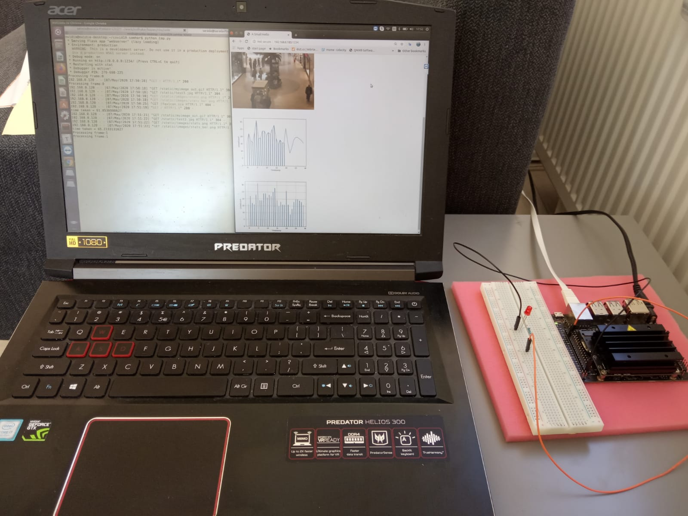
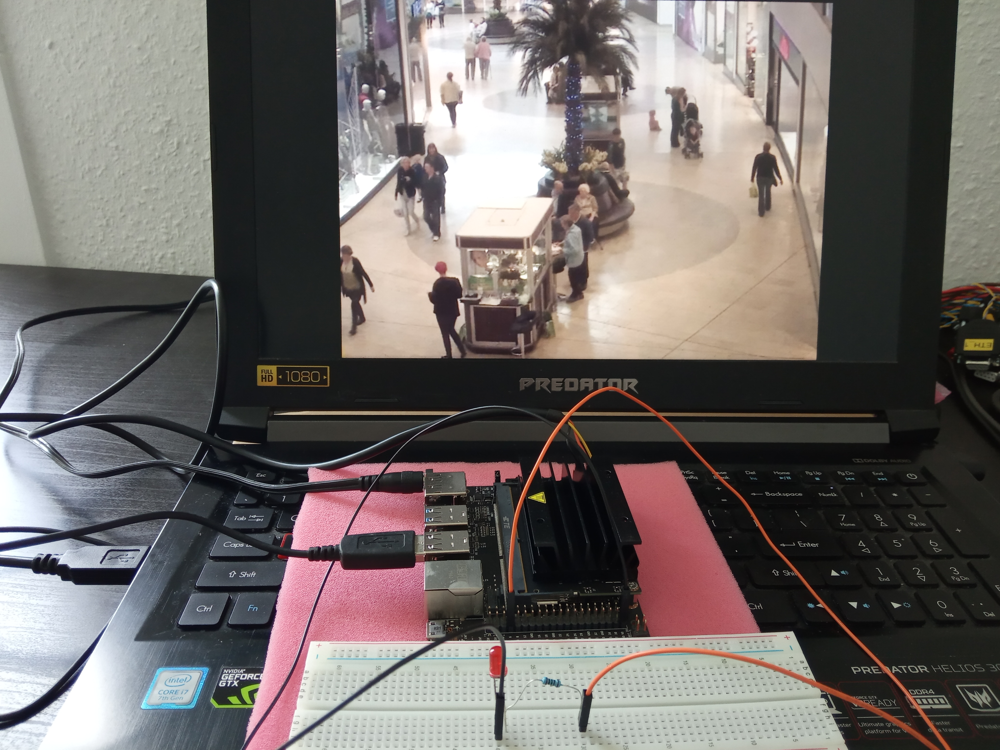
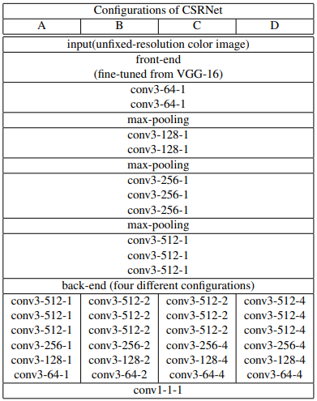

# Covid19-Samhar : Public Health Surveillance and Monitoring

## Crowd Tracking System by using NVidia Jetson Nano platform

### Problem Statement

In order to enforce social distancing, it is important to monitor suspicious scenarios like crowd gathering or tracking etc. 
Usage of AI (Convolution Neural Network) has surpassed traditional Computer Vision techniques and can help to automate this pattern recognition. 
The objective of this problem statement is to find different pattern on input sources like camera, satellite, social platforms which can help to identify  suspicious activities to stop or track covid-19 spread.

### Description

When a suspicious crowd gathering is detected, this system detects it and alerts the crowd through audio messages. If the crowd do not respond for the alerts or based on the necessity the respective information (ex: crowd count, statistics, gps info (if required) etc) to the centralized crowd tracking server. Server will maintain the data received from different Crowd Tracking systems and will hold the algorithms to generate different statistics and send the notification to respective authorities to react in time and scatter the crowd to maintain social distancing and to stop spreading the disease.

We propose a smart embedded system that can be deployed as a Edge Computing Device in public places for the purpose of raising an alarm in scenarios like violation of the social distancing. Further our system also serves as a intelligent entity that can gather the statistics about the peak, average crowd distribution over a period of time, in the public places.
 
For crowd tracking, we used a Convolutional Neural Network called CSRNet (which is based on VGGNet) which can understand highly congested scenes and perform accurate count estimation and generates high quality density maps. We used pytorch framework to train the CSRNet. For the inference in real time, we used Nvidia Jetson Nano platform as the Edge Computing Device.

### System Output

The following animation illustrates the input to the system and the output heatmap.

    

    

The following Figure shows how the statistics is generated on the Edge Computing Device and 
accessed from the remote server:

    

## Architecture
The following Figure depicts the overall system architecture.

    
Our system will be useful in public places which is known to be susceptible for crowd gathering. This system has to be mounted at suitable place (with sufficient altitude), so that it is able to visually sense, perceive the crowd gathering and take a suitable action. Our system will serve twofold purpose.
* It will raise a sound alarm and notify the concerned authorities, in case it perceives a violation of the social distancing norm.
* It will collect statistics about the number of people at different times in the day, the average, the peak etc.

Our demo setup looks like the following:
    

## Detailed Design

The following Figure depicts the components of the system. 
    

### Camera
We propose to use an USB webcam or a CSI based Raspberry-Pi camera that can be attached to the Edge Processing Unit. This camera is going to capture the image and feed it to the Jetson Nano. The camera framerate can be set to 1fps or 0.5fps.

### Jetson Nano Device 
The heart of the system is the NVidia Jetson Nano platform. This is an embedded device with high computational capability. We run a neural network on this device which can accept camera input image and predict the count of people in the image. This is the place where the core computation happens and intelligent decisions are taken. 
Additionally we run a web application on the Nano to track the statistics of the crowd count. 

### Audio Warning System
We propose to connect an audio warning unit (like an alarm or audio notification) to the Jetson Nano. This component will be triggered by the Jetson Nano in case of a suspicious activity like too may people close to each other.

### Crowd Tracking Server
This could be a remote computer in a concerned office that can connect to the Jetson Nano via a web browser and get the statistics of the crowd gathering.

### Remote clients
These could be mobile phones which receives notifications from the crowd tracking server regarding the suspicious activity or the statistics at regular intervals.

## Visual Computing: CSRNet
We make use of the CSRNet[1], which provides a data-driven and deep learning method that can understand highly congested scenes and perform accurate count estimation as well as present high-quality density maps. The proposed CSRNet is composedof two major components: a convolutional neural network(CNN) as the frontend for 2D feature extraction and a dilated CNN for the backend, which uses dilated kernels to deliver larger reception fields and to replace pooling operations. CSRNet is an easily trainable model because of its pure convolutional structure.  

The architecture of the CSRNet looks like the following:

    

We make use of the mall dataset[2] for training and inference of the model.

## Next Steps
* We plan to perform model optimization by converting the pytorch model to tensorrt model for faster inference.
* Another aspect is to fine-tune the model for Indian dataset.
* To achieve cost optimization, we are interested to explore low cost microcontrollers for this system.
* Come up with a robust method to tackle different challenges like low-light condition, obstructions etc.

## References
[1] CSRNet: Dilated convolutional neural networks for understanding the highly congested scenes, Li, Yuhong and Zhang, Xiaofan and Chen, Deming, Proceedings of the IEEE Conference on Computer Vision and Pattern Recognition, pages 1091--1100, year 2018.

[2] Mall Dataset: https://personal.ie.cuhk.edu.hk/~ccloy/downloads_mall_dataset.html
