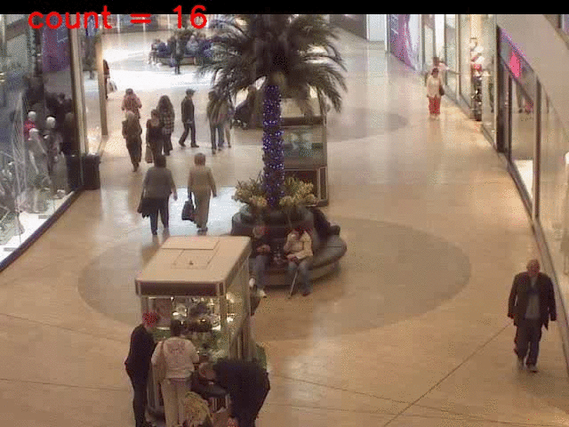
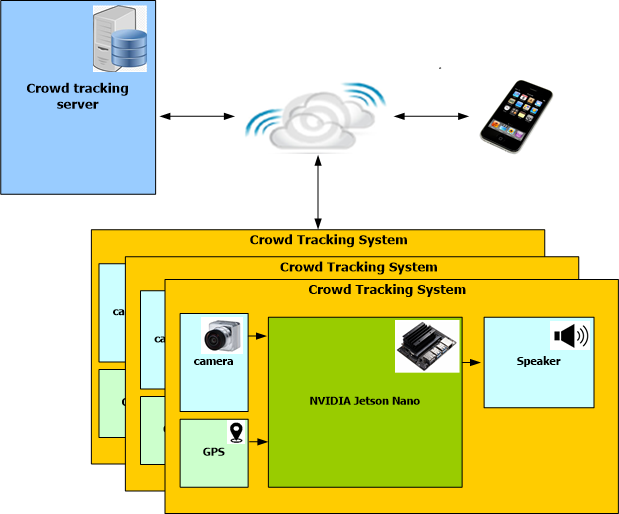
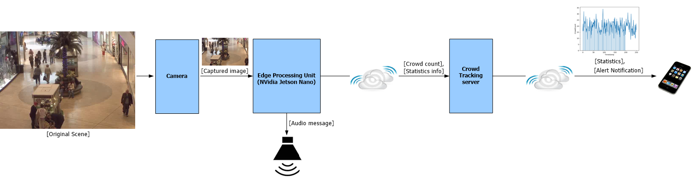

# covid19-samhar

# Public Health Surveillance and Monitoring

## Problem Statement

In order to enforce social distancing, it is important to monitor  suspicious scenarios like crowd gathering or tracking etc. Usage of AI  (Convolution Neural Network) has surpassed traditional Computer Vision  techniques and can help automate this pattern recognition. The objective of this problem statement is to find different pattern on input sources like camera, satellite, social platforms which can help identify  suspicious activities to stop or track covid-19 spread.

## Description
We propose a smart embedded system that can be deployed as a Edge Computing Device in public places for the purpose of raising an alarm in scenarios like violation of the social distancing. Further our system also serves as a intelligent entity that can gather the statistics about the peak, average crowd distribution over a period of time, in the public places. 
The idea is to use crowd counting technique to identify the suspicious scenarios like crowd gathering, tracking etc during the social distancing and lockdown scenarios(during Pandemic diseases).
We considered to use CSRNet (which is based on VGGNet) which can understand highly congested scenes and perform accurate count estimation and high quaity density maps. 
We used pytorch framework to train and generate the model. We chose Nvidia Jetson Nano as a potential platform to run our model.

The idea is to detect the crowd gathering and indicate this information to the respective authorities to react in time and scatter the crowd to maintain social distancing and to stop spreading the disease.

# Demo 

### Demo: Heatmap

The following animation illustrates the input to the system and the output heatmap.

    

    

### Demo2: Web browser based statistics

### Demo3: LED blinking in case of emergency

# Architecture
Fig.{X} depicts the overall system architecture.

    
Our system will be useful in public places which is known to be susceptible for crowd gathering. This system has to be mounted at suitable place (with sufficient altitude), so that it is able to visually sense, perceive the crowd gathering and take a suitable action. Our system will serve twofold purpose.
* It will raise a sound alarm and notify the concerned authorities, in case it perceives a violation of the social distancing norm.
* It will collect statistics about the number of people at different times in the day, the average, the peak etc.

# Detailed Design
Fig. {Y} depicts the components of the system. 
    
## Camera
We propose to use an USB webcam or a CSI based Raspberry-Pi camera that can be attached to the Edge Processing Unit. This camera is going to capture the image and feed it to the Jetson Nano. The camera framerate can be set to 1fps or 0.5fps.

## Jetson Nano Device 
The heart of the system is the NVidia Jetson Nano platform. This is an embedded device with high computational capability. We run a neural network on this device which can accept camera input image and predict the count of people in the image. This is the place where the core computation happens and intelligent decisions are taken. 
Additionally we run a web application on the Nano to track the statistics of the crowd count. 

## Audio Warning System
We propose to connect an audio warning unit (like an alarm or audio notification) to the Jetson Nano. This component will be triggered by the Jetson Nano in case of a suspicious activity like too may people close to each other.

## Crowd Tracking Server
This could be a remote computer in a concerned office that can connect to the Jetson Nano via a web browser and get the statistics of the crowd gathering.

## Remote clients
These could be mobile phones which are sent notifications from the crowd tracking server regarding the suspicious activity or the statistics at regular intervals.

# Implementation Details
In this section we discuss about how we have implemented the proposed system.
## Visual Computing: CSRNet
We make use of the CSRNet[1]

## Webserver framework: Flask
# Next Steps

# References
[1] CSRNet: Dilated convolutional neural networks for understanding the highly congested scenes, Li, Yuhong and Zhang, Xiaofan and Chen, Deming, Proceedings of the IEEE Conference on Computer Vision and Pattern Recognition, pages 1091--1100, year 2018.
